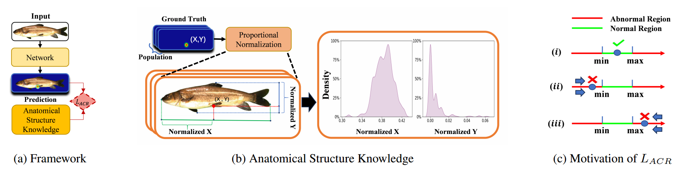

# Benchmarking Fish Dataset and Evaluation Metric in Keypoint Detection -Towards Precise Fish Morphological Assessment in Aquaculture Breeding

  

  

  

  

This repository contains the code and dataset for the paper "Benchmarking Fish Dataset and Evaluation Metric in Keypoint Detection -Towards Precise Fish Morphological Assessment in Aquaculture Breeding," accepted at IJCAI2024 in the AI and Social Good track.

[Weizhen Liu1](https://www.researchgate.net/profile/Weizhen-Liu), [Jiayu Tan1](https://arxiv.org/search/cs?searchtype=author&query=Tan,+J), [Guangyu Lan1](https://arxiv.org/search/cs?searchtype=author&query=Lan,+G), [Ao Li1](https://arxiv.org/search/cs?searchtype=author&query=Li,+A), [Dongye Li4](https://arxiv.org/search/cs?searchtype=author&query=Li,+D), [Le Zhao1](https://arxiv.org/search/cs?searchtype=author&query=Zhao,+L), [Xiaohui Yuan1,3 *](https://arxiv.org/search/cs?searchtype=author&query=Yuan,+X), [Nanqing Dong2 *](https://eveningdong.github.io/)

1School of Computer Science and Artificial Intelligence, Wuhan University of Technology

2Shanghai Artificial Intelligence Laboratory

3Yazhouwan National Laboratory

4Sanya Boruiyuan Technology Co. Ltd

{liuweizhen, tjy2023305211,yuanxiaohui}@whut.edu.cn, dongnanqing@pjlab.org.cn

## Overview

- [Motivation and design](#Motivation and design)

- [Dataset](#Dataset)
- [Environment Setup](#Environment Setup)
- [Citations](#Citations)

##  Motivation and design

Accurate phenotypic analysis in aquaculture breeding necessitates detailed morphological data, yet current datasets are small-scale, species-limited, and lack comprehensive annotations. To address these shortcomings, we introduce FishPhenoKey, a dataset of 23,331 high-resolution images across six fish species, annotated with 22 phenotype-oriented keypoints. This dataset facilitates precise measurement of complex morphological features critical for advanced aquaculture research.

FishPhenoKey is designed to support diverse research needs with flexibility and scalability. By integrating high-resolution imaging and robust annotation protocols, it provides the necessary diversity and detail for accurate phenotypic analysis. The modular design of FishPhenoKey ensures compatibility with various evaluation metrics and keypoint detection models, enabling continuous updates and expansion to accommodate future advancements in aquaculture and genetic studies.

## Dataset

If you need the complete dataset, please download the [FishPhenoKey Dataset User Agreement] and read the relevant regulations. If you agree to the regulations, please fill in the relevant user information in the user agreement, [authorization date], and [electronic signature] at the end of the agreement. Send the PDF format of the user agreement to the email **[tjy2023305211@whut.edu.cn](mailto:tjy2023305211@whut.edu.cn)**. After review, we will send the download link for the complete dataset via email.

## Environment Setup:

* Python 3.6/3.7/3.8
* Pytorch 1.10 or above
* pycocotools (Linux: `pip install pycocotools`; Windows: `pip install pycocotools-windows` (no need to install VS separately))
* Ubuntu or CentOS (Windows not recommended)
* Preferably use GPU for training
* For detailed environment setup, refer to `requirements.txt`

## Citations
Please cite our paper in your publications if our methods and dataset are helpful to your research. The BibTeX is as follows:

~~~
@article{liu2024benchmarking,
  title={Benchmarking Fish Dataset and Evaluation Metric in Keypoint Detection-Towards Precise Fish Morphological Assessment in Aquaculture Breeding},
  author={Liu, Weizhen and Tan, Jiayu and Lan, Guangyu and Li, Ao and Li, Dongye and Zhao, Le and Yuan, Xiaohui and Dong, Nanqing},
  journal={arXiv preprint arXiv:2405.12476},
  year={2024}
}
~~~

